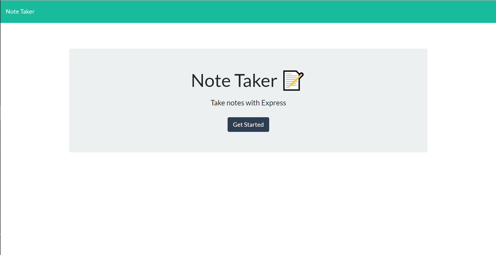
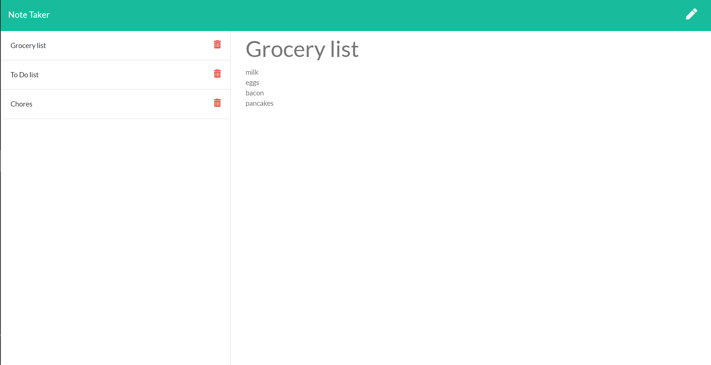

# Express-note-maker

    <h4>
    </a>
    
    
        
    </h4>

This is a note taking application

  <h4>
    <a href="https://github.com/ThomasMullaney/Express-note-maker">
      Github Repository
    </a>
 | 
<a href="https://note-taking-pad-app.herokuapp.com/">
      Heroku Deployment
    </a>
  </h4>

 

## Description:
### A note taking application.

## Table of Contents:
     
1. [Installation](#installation)
2. [Usage](#usage)
3. [License](#license)
4. [Contributing](#contributing)
5. [Tests](#tests)
6. [Questions](#questions) 

## Installation: 
### npm install && npm start

## Usage:
### The user is able to create and save notes, view previously saved notes, and delete previously saved notes.

## License:
### 
    
## Contributing:
### Tom Mullaney

## Tests:
### 

    
## Questions:
### github.com/ThomasMullaney
### tloring.mullaney@gmail.com
    
    